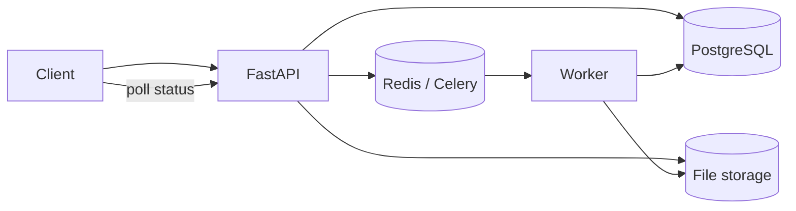

# DocFlow

[](https://github.com/MridulJain0771/docflow/actions/workflows/ci.yml)

**Distributed document-processing backend built with FastAPI, PostgreSQL, Redis and Celery.**

DocFlow accepts PDF uploads, returns immediately with a durable job ID, processes documents asynchronously, tracks progress, retries failures and exposes job state through an API.

## Why this project

TaskForge demonstrates production API engineering. DocFlow focuses on a different backend problem: **asynchronous distributed work, queue reliability, worker lifecycle and large-file processing**.

## Architecture



## Current features

- PDF upload endpoint returning HTTP `202 Accepted`
- Durable job state: `queued`, `processing`, `retrying`, `completed`, `failed`
- Progress tracking from 0–100
- PostgreSQL + async SQLAlchemy
- Celery workers with Redis broker/result backend
- Retry-on-failure worker semantics
- SHA-256 duplicate detection with a database uniqueness guard
- Download endpoint for completed extraction results
- Late task acknowledgements and fair worker prefetching
- PDF text extraction with page/character metrics
- Result-file persistence
- Liveness and dependency-aware readiness probes
- Docker Compose for API, PostgreSQL, Redis and worker
- Non-root Docker runtime user
- Alembic migrations
- Unit/integration tests and GitHub Actions CI
- Architecture and scaling documentation

## API

| Method | Endpoint | Purpose |
|---|---|---|
| `POST` | `/api/v1/documents` | Upload a PDF and enqueue processing |
| `GET` | `/api/v1/documents` | List processing jobs |
| `GET` | `/api/v1/documents/{id}` | Get status/progress/results metadata |
| `GET` | `/api/v1/documents/{id}/result` | Download extracted text after completion |
| `GET` | `/health/live` | Process liveness |
| `GET` | `/health/ready` | PostgreSQL + Redis readiness |

## Run locally

```bash
cp .env.example .env
docker compose up --build
```

Then open Swagger at `http://localhost:8000/docs`.

Upload a PDF:

```bash
curl -X POST http://localhost:8000/api/v1/documents \
  -F "file=@sample.pdf;type=application/pdf"
```

Poll the returned document ID:

```bash
curl http://localhost:8000/api/v1/documents/<document-id>
```

## Processing lifecycle

```text
upload
  ↓
queued
  ↓
worker receives task
  ↓
processing + progress updates
  ↓
extract pages
  ↓
write result
  ↓
completed

failure → retrying → Celery retry → failed after retry budget
```

## Next phases

- S3-compatible object storage abstraction
- checksum-based duplicate detection
- webhook callback delivery
- dead-letter/failure queue handling
- metrics and tracing
- workload-aware worker routing
- API authentication and per-user quotas

See [`docs/ARCHITECTURE.md`](docs/ARCHITECTURE.md) for deeper engineering decisions.
