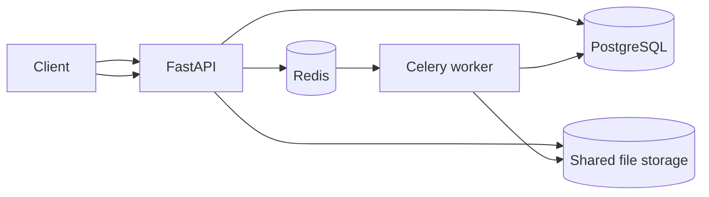

# DocFlow Architecture

## Goal

DocFlow demonstrates a distributed document-processing pipeline where API request latency is kept separate from CPU/I/O-heavy document extraction.

## Processing lifecycle

1. The client uploads a PDF.
2. The API persists the file and creates a `queued` document job.
3. The API enqueues the job in Celery and immediately returns HTTP 202.
4. A worker moves the job to `processing`, extracts each page, and updates progress.
5. Extracted text is stored separately and metadata is written to PostgreSQL.
6. The job becomes `completed` or `failed`.

## Reliability choices

- Celery tasks use late acknowledgements so worker crashes do not silently lose accepted work.
- Worker prefetch is limited to one task to reduce unfair queue consumption for large PDFs.
- A worker creates short-lived SQLAlchemy engines with `NullPool` so Celery's sync task process does not reuse async connections across event loops.
- Job state is durable in PostgreSQL rather than stored only in the queue.
- API readiness checks PostgreSQL and Redis separately from process liveness.

## Scaling path

For production scale, replace local shared storage with S3-compatible object storage, add per-tenant quotas, checksum-based deduplication, webhook delivery, dead-letter queues, OpenTelemetry traces, and worker pools separated by document size or workload type.
